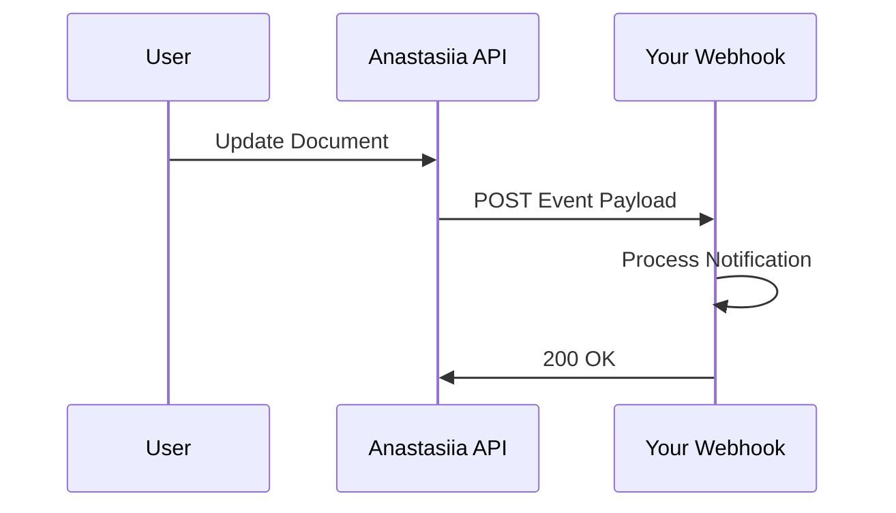

## Overview

Anastasiia Konevytska integrates seamlessly with popular third-party services, enabling you to automate workflows, sync content, and extend functionality. Use built-in integrations for tools like GitHub and Slack, set up webhooks for real-time notifications, access the REST API for custom extensions, and handle exports/imports in multiple formats.

<Callout kind="info">
  All integrations require an active Anastasiia Konevytska account. Generate your `{API_KEY}` from the dashboard settings.
</Callout>

## Supported Integrations

Connect Anastasiia Konevytska to essential tools for collaboration and automation.

<Columns cols={3}>
  <Card title="GitHub" icon="github" href="https://github.com">
    Sync documentation repos automatically. Push updates directly from GitHub.
  </Card>
  <Card title="Slack" icon="message-circle" href="#">
    Receive real-time notifications for doc changes and approvals.
  </Card>
  <Card title="Zapier" icon="zap" href="https://zapier.com">
    Build no-code automations with 5000+ apps.
  </Card>
</Columns>

## Setting Up Webhooks

Webhooks notify external services about events like document updates or publishes.

<Steps>
  <Step title="Create Webhook" icon="plus">
    Navigate to Dashboard > Integrations > Webhooks. Click "New Webhook".
  </Step>
  <Step title="Configure Events" icon="settings">
    Select events: `doc.updated`, `doc.published`. Enter your endpoint URL.
  </Step>
  <Step title="Test and Save" icon="play">
    Send a test payload. Verify receipt, then save.
  </Step>
</Steps>



## API Access for Custom Extensions

Build custom integrations using the Anastasiia Konevytska REST API at `https://api.example.com/v1`.

<ParamField path="webhook" param-type="object" required="true">
  Webhook configuration object.
</ParamField>

<ParamField header="Authorization" param-type="string" required="true">
  Use `Bearer {YOUR_TOKEN}`.
</ParamField>

<Request tabs="JavaScript,cURL" show-lines="true">
  ```javascript
  const response = await fetch('https://api.example.com/v1/webhooks', {
    method: 'POST',
    headers: {
      'Authorization': `Bearer ${YOUR_TOKEN}`,
      'Content-Type': 'application/json'
    },
    body: JSON.stringify({
      url: 'https://your-webhook-url.com/webhook',
      events: ['doc.updated']
    })
  });
  ```
  ```bash
  curl -X POST https://api.example.com/v1/webhooks \
    -H "Authorization: Bearer YOUR_TOKEN" \
    -H "Content-Type: application/json" \
    -d '{
      "url": "https://your-webhook-url.com/webhook",
      "events": ["doc.updated"]
    }'
  ```
</Request>

<Response tabs="200">
  ```json
  {
    "id": "wh_abc123",
    "url": "https://your-webhook-url.com/webhook",
    "events": ["doc.updated"],
    "active": true
  }
  ```
</Response>

## Export and Import Options

Export your documentation in various formats or import from external sources.

<Tabs>
  <Tab title="Markdown Export" icon="file-text">
    Export entire spaces or single pages as Markdown files.
    
    <CodeGroup tabs="JavaScript,Python">
      ```javascript
      const fs = require('fs');
      const response = await fetch('https://api.example.com/v1/export/markdown?spaceId=space_123', {
        headers: { 'Authorization': `Bearer ${YOUR_TOKEN}` }
      });
      fs.writeFileSync('docs.md', await response.text());
      ```
      ```python
      import requests
      response = requests.get(
          'https://api.example.com/v1/export/markdown?spaceId=space_123',
          headers={'Authorization': f'Bearer {YOUR_TOKEN}'}
      )
      with open('docs.md', 'w') as f:
          f.write(response.text)
      ```
    </CodeGroup>
  </Tab>
  <Tab title="JSON Import" icon="upload">
    Import structured content from JSON payloads.
    
    <Callout kind="tip">
      Ensure your JSON matches the import schema for validation.
    </Callout>
  </Tab>
</Tabs>

<Expandable title="Advanced: Custom Payload Verification">
  Verify webhook payloads using HMAC signatures.
  
  ```javascript
  const crypto = require('crypto');
  const signature = crypto
    .createHmac('sha256', WEBHOOK_SECRET)
    .update(payload)
    .digest('hex');
  ```
</Expandable>